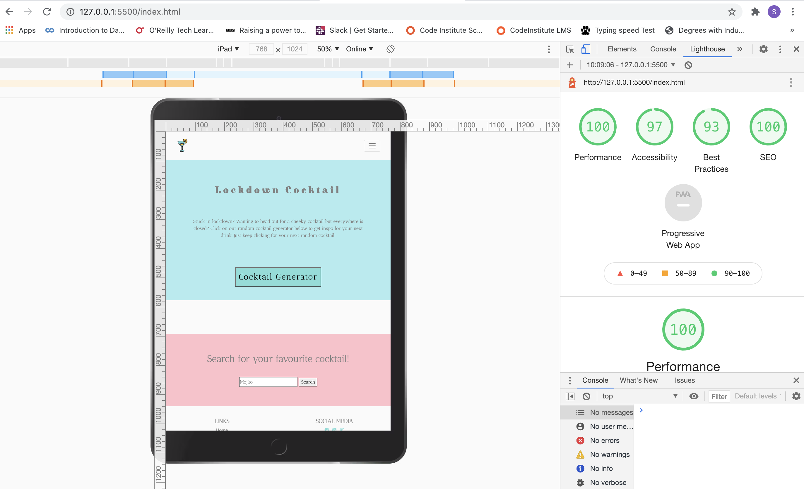

## Testing

I used Google Chrome Developer Tools throughout the project. It was an invaluable resource to check how HTML and CSS changes would look. It was a particularly useful tool to have when checking for responsiveness on difference sized devices. In particular, when checking the embedded YouTube video worked on smaller screen devices in horizontal view. The video is best viewed in horizontal mode on tablet and mobile devices. Another way the Developer Tools were useful was for viewing the Bootstrap navbar, cards and contact form. I had used the Bootstrap responsive classes in order to make sure they filled the screen on smaller devices. I am happy with the mobile first design of the website and the way it looks clear and easy to read on a mobile sized device. With current trends in how users are viewing websites a mobile first design and good user experience on small devices is crucial. The website also lends itself to tablet sized devices. The only criticism for viewing on a tablet sized device is that the Contact page and Media page have some dead space that could be utilised.

When I first viewed my Contact page using the Developer Tools in Chrome, I noticed that the heading and subheading for the page pushed the contact form lower down on smaller device sizes. This meant that the user experience would be hindered and visually it was not appealing. I decided to use media queries to hide the subheading for smaller devices to eliminate this visual issue.

I used the Lighthouse tool to check over my website in the final tests. In my first check of the home page a notification came up that I had some issues with Best Practices on my social media <a> tags. Lighthouse informed me to add in rel="noopener" in order to prevent any malicious backlinks from the URLs. I then redid the Lighthouse check and received the below report which I am happy with.

The report for the home page can be viewed below and 
[here](assets/testing/testing_screenshots/lighthouse.png)

 

#### W3C Validator Testing
I used the W3C validators for HTML and CSS to check my code. I used the BeautifyTools to check my Javascript: http://beautifytools.com/javascript-validator.php On the final test there were no errors found. There were a few errors throughout my work on the project that I corrected as I developed.

#### User Stories

User Story 1: be able to search for the name of my favourite cocktail by name or ingredient, view and then easily recreate it.

[User Story 1 View Here](assets/testing/user_stories/userstory1.png) 

User Story 2: be inspired by a random cocktail choice and view (a fun feature to recreate the feel of asking the mixologist to choose a drink for you and make it).

[User Story 2 View Here](assets/testing/user_stories/userstory2.png) 
[User Story 2 Result View Here](assets/testing/user_stories/userstory2_result.png) 

User Story 3: be easily directed to any social media channels that can add additional viewing material to entice a user to connect with the Lockdown Cocktail community.

[User Story 3 View Here](assets/testing/user_stories/userstory3.png) 

User Story 4: be able to instinctively navigate the website to find the information required efficiently.

[User Story 4 Desktop View Here](assets/testing/user_stories/userstory4_desktop.png) 
[User Story 3 Responsive View Here](assets/testing/user_stories/userstory4_responsive.png) 

User Story 5: be able to contact Lockdown Cocktail to request any cocktail receipes that may not be available within the search feature.

[User Story 5 View Here](assets/testing/user_stories/userstory5.png) 

#### Feature Testing

| Page       | Action Taken  | Expected Result  | Pass/Fail | 
| -----------|:-------------:| ----------------:| ---------:|
| index.html | Clicked on random cocktail button |   API call and display random cocktail with name, recipe and image     |    Passed    |
| contact.html | Add initial emailJS script tag to check connected to personal email    |   Receive blank email template | Passed
| index.html | Click on logo in top left corner  |   Keeps you on homepage  | Passed |
| index.html (991px and under) | Click on hamburger button | Opens up the navbar items 'home' and 'contact' | Passed
| index.html (991px and under) | Click on home text within hamburger button | Keeps you on homepage | Passed
| index.html (991px and under) | Click on contact text within hamburger button | Takes you to contact page | Passed 
| index.html (991px and under) | Click on hamburger button with navbar items open | Closes navbar | Passed
| index.html (991px and above) | Click on 'Home' in navbar | Remain on homepage | Passed
| index.html (991px and above) | Click on 'Contact' in navbar | Redirected to Contact page | Passed
| index.html | Click on 'Cocktail Generator' button | A random cocktail from API will display below the button | Passed 
| index.html | Click on 'Cocktail Generator' button again | A new random cocktai displays | Passed
| index.html | Click on search input bar | Text able to be inputted and deleted, shown by flashing text bar and cross icon | Passed
| index.html | Text inputted into search bar | See displayed text | Passed
| index.html | Nonsense text put in search bar | Alert displayed on screen that data wasn't fetched | Passed
| index.thml | Test cocktail names tried (cosmo, mai tai, mojito) | See a cocktail with that name displayed below the searchbar | Passed
| index.html | Navbar in footer click on 'home' | Remain on home page | Passed
| index.html | Navbar in footer click on 'contact' | Link to contact page works and redirected | Passed
| index.html | Click on facebook icon | A new webpage tab opens to the Facebook homepage | Passed
| index.html | Click on Youtube icon | A new webpage tab opens to the Youtube homepage | Passed
| index.html | Click on Youtube icon | A new webpage tab opens to the instagram homepage | Passed
| contact.html | Click on logo in top left corner  |   Keeps you on homepage  | Passed |
| contact.html(991px and under) | Click on hamburger button | Opens up the navbar items 'home' and 'contact' | Passed
| contact.html (991px and under) | Click on home text within hamburger button | Keeps you on homepage | Passed
| contact.html (991px and under) | Click on contact text within hamburger button | Takes you to contact page | Passed 
| contact.html (991px and under) | Click on hamburger button with navbar items open | Closes navbar | Passed
| contact.html (991px and above) | Click on 'Home' in navbar | Redirected to home page | Passed
| contact.html (991px and above) | Click on 'Contact' in navbar | Remain on contact page | Passed
| contact.html | Able to click and enter text into 'Name' placeholder input field | Text inputted | Passed
| contact.html | Able to click and enter text into 'Email' placeholder input field | Text inputted | Passed
| contact.html | Able to click and enter text into 'Message' placeholder input field | Text inputted | Passed
| contact.html | Hover mouse over 'Send Message' button | Mouseover gloved hand appears | Passed
| contact.html | Click 'Send Message' button | Email to be sent to my personal email for project purposes with name, email and message | 
| contact.html | Navbar in footer click on 'home' | Redirected to home page | Passed
| contact.html | Navbar in footer click on 'contact' | Remain on contact page | Passed
| contact.html | Click on facebook icon | A new webpage tab opens to the Facebook homepage | Passed
| contact.html | Click on Youtube icon | A new webpage tab opens to the Youtube homepage | Passed
| contact.html | Click on Youtube icon | A new webpage tab opens to the instagram homepage | Passed

#### Bug Testing

| Bugs Found | Action to fix | Link to fix commit| 
| -----------|:-------------:| -----------------:| 
|        Link back to home page not working on contact page footer    |     Add link to index.html in contact.html footer      |  https://github.com/Telesia/Lockdown-Cocktail-V2/commit/5670a4132a4ed47923a914997c513e96b3133d74                 | 
|      |   |    |
| |      |    |